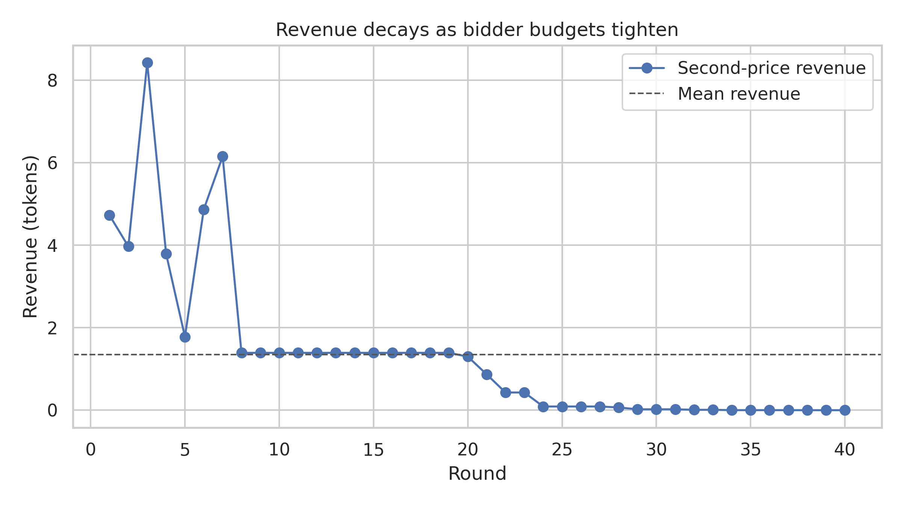

# Play to Innovate: An Interdisciplinary Approach from Game Theory to Mechanism Design



## Title Page Essentials

- **Author**: Boyan Zhang  
- **Roles**: Economist · Computational Scientist · Behavioral Scientist · Mechanism Designer  
- **Contribution to SDGs**: SDG 4 (Quality Education), SDG 9 (Industry, Innovation, and Infrastructure), SDG 16 (Peace, Justice, and Strong Institutions), SDG 17 (Partnerships for the Goals).  
- **Acknowledgments**: Prof. Luyao Zhang, classmates in COMSCI/ECON 206, and open-source communities supporting NashPy, QuantEcon, oTree, pandas, and matplotlib.  
- **Disclaimer (verbatim)**: This project is the final research proposal submitted to STATS 201: Machine Learning for Social Science, instructed by Prof. Luyao Zhang at Duke Kunshan University in Autumn 2025.  
- **Repository Disclaimer**: This repository supports the final research proposal submitted to COMSCI/ECON 206: Computational Microeconomics at Duke Kunshan University (Autumn 2025).  
- **Statement of Growth**: Integrating PS1 and PS2 strengthened my mastery of Nash/SPNE/Bayes-Nash equilibria, Monte Carlo experimentation, and institutional design. Collaborating with peers, coding reproducible pipelines, and reflecting on ethical implications deepened my professional practice.

## Table of Contents

1. [Project Overview](#project-overview)  
2. [Research Roadmap](#research-roadmap)  
3. [Repository Navigation](#repository-navigation)  
4. [Embedded Media](#embedded-media)  
5. [Getting Started](#getting-started)  
6. [Sustainable Development Goals](#sustainable-development-goals)  
7. [References](#references)

## Project Overview

The project examines a repeated budget-constrained second-price auction informed by field observations at Shanghai fintech sandboxes. Simulations, behavioural coding, and institutional design culminate in an adaptive mechanism that replenishes budgets and introduces transparent quadratic voting.

## Research Roadmap

### Part 1 – Strategic Game Foundations
- Formal model documented in [`economist/auction_game.md`](economist/auction_game.md).  
- Monte Carlo evidence stored in [`computational_scientist/results/auction_rounds.csv`](computational_scientist/results/auction_rounds.csv) and summarised visually in `visualizations/auctions/revenue_by_round.png` and `visualizations/auctions/winners_curse_frequency.png`.  
- Efficiency rate (22.5%) and winner's-curse episodes (7.5%) trace deviations from Nash predictions.

### Part 2 – Mechanism Design & Auctions
- Counterfactual simulations via [`computational_scientist/scripts/auction_simulator.py`](computational_scientist/scripts/auction_simulator.py).  
- Behavioural triangulation captured in [`behavioral_scientist/triangulation.md`](behavioral_scientist/triangulation.md).  
- Mechanism recommendations compiled in [`docs/Report.md`](docs/Report.md#part-2--mechanism-design--auctions).

### Part 3 – Voting & Institutions
- UNSC quadratic voting transcripts in [`mechanism_design/implementations/llm_transcripts.md`](mechanism_design/implementations/llm_transcripts.md).
- Decision heatmap `visualizations/voting/credit_option_heatmap.png` diagnoses legitimacy gaps.
- Final institutional blueprint detailed in [`docs/Report.md`](docs/Report.md#part-3--voting--institutions).

## Repository Navigation

```text
CS206-Final-Framework/
├── economist/                  # Game specification and welfare analysis
├── computational_scientist/    # Simulation engine and quantitative outputs
├── behavioral_scientist/       # Behavioural triangulation notes
├── mechanism_design/           # Auction/voting artefacts and LLM transcripts
├── visualizations/             # Generated figures and summary tables
├── docs/                       # Report and field-trip reflection
├── GETTING_STARTED.md          # Legacy setup instructions (retained)
├── STRUCTURE.md                # Course-provided scaffolding reference
└── requirements.txt            # Python dependencies
```

Key waypoints for reviewers:
- **Equilibria & proofs**: `economist/auction_game.md`  
- **Simulation code**: `computational_scientist/scripts/auction_simulator.py`  
- **Round-level data**: `computational_scientist/results/auction_rounds.csv`  
- **Voting transcripts**: `mechanism_design/implementations/llm_transcripts.md`  
- **Documentation**: `docs/Report.md`, `docs/FieldTripReflection.md`

## Embedded Media

- **Demo Video**: *Not available* – see note in final summary for future recording plans.

## Getting Started

```bash
# Clone the repository
git clone https://github.com/Johnnybyzhang/CS206-Final-Framework.git
cd CS206-Final-Framework

# Install dependencies
pip install -r requirements.txt

# Reproduce auction simulations
python computational_scientist/scripts/auction_simulator.py --rounds 40 --seed 42

# Regenerate figures
python visualizations/generate_figures.py
```

For behavioural extensions (oTree deployments or additional LLM prompts), consult subdirectory READMEs.

## Sustainable Development Goals

- **SDG 4 – Quality Education**: Open-sourced code, data, and documentation supporting future cohorts.  
- **SDG 9 – Industry, Innovation, and Infrastructure**: Mechanism tweaks ready for fintech sandboxes and civic tech pilots.  
- **SDG 16 – Peace, Justice, and Strong Institutions**: Transparency dashboards and quadratic voting blueprint enhance legitimacy.  
- **SDG 17 – Partnerships for the Goals**: Interdisciplinary collaboration across economics, computer science, and behavioural science.

## References

See the full bibliography in [`docs/Report.md`](docs/Report.md#references) for detailed citations covering game theory, mechanism design, and institutional design sources.
